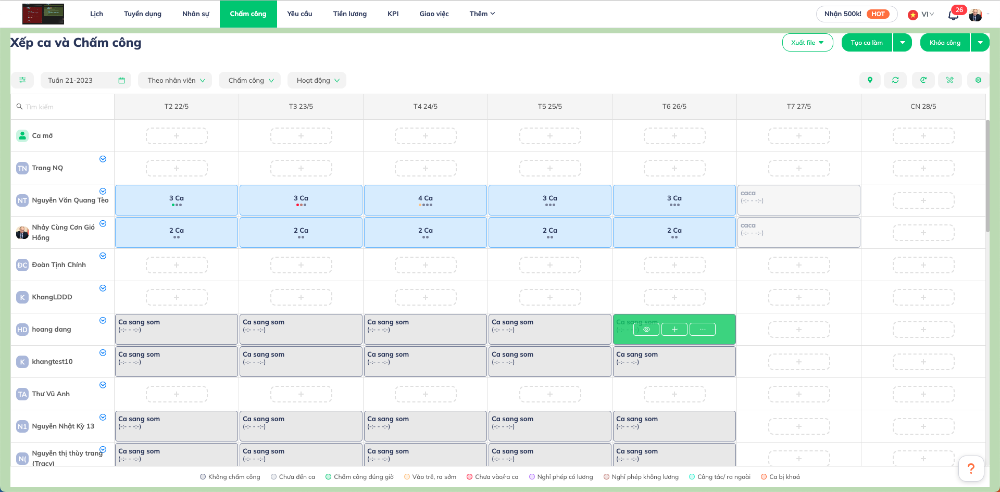
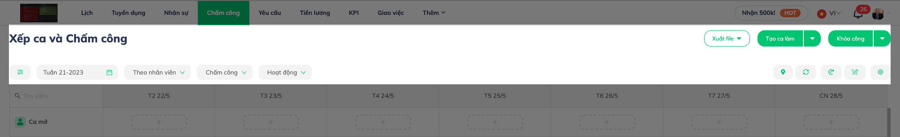
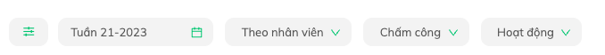

# Layout

Layout cơ bản cho 1 trang (page)



- padding top: **10px**
- padding bottom: **10px**
- padding left: **20px**
- padding right: **20px**

## Phần trên (Header)



### Phần trên bên trái (Title)


Tiêu đề của trang web

```js
<h3 className="page-list__title">
  {intl.formatMessage(Messages.schedule_x_timesheet)}
</h3>
```

nếu là trang phụ thì phải có nút quay lại:

```js
<Button
  className="left-arrow-back mr-3"
  onClick={() => {}}>
  <i className="far fa-long-arrow-left"></i>
</Button>
```

### Phần trên bên phải (Main buttons)


Chứa các [ButtonWithDropdown](/docs/front-end/web-admin/components/button-with-dropdown) với mục đích chính:

- ** Thêm mới **
- ** Xuất file **
- và **một số tính năng đặc biệt** (Khóa bảng công, Công bố ca,...)

_Các nút (button) còn lại để hết ở phần dưới (Buttons)_

### Phần dưới bên phải (Buttons)


Chứa các nút (button) chức được sử dụng trong page

```js
<Button
  type="ghost"
  onClick={() => {}}>
  <i class="far fa-cog"></i> // fontawesome icon
</Button>
```

- ** Chỉ để icon ** (nên dùng icon của FontAwesome)
- ** Không để label ** của nút
- ** Cách đều nhau _"ml-2"_** (chỉ nên margin 1 bên trái của các nút để đều nhau)
- ** Dùng cùng kiểu icon với nhau ** (Vd: Regular hết hoặc Solid hết)

### Phần dưới bên trái (Filters)



Chứa các thành phần liên quan đến ** bộ lọc **

- **Tất cả phải dùng để lọc danh sách phía dưới **
- Nếu có bộ lọc ẩn bên trái ** nút icon bộ lọc phải ngoài cùng bên trái **
- Khi thay đổi giá trị **phải lọc lại danh sách **

:::caution Lưu ý
Nếu để ý thì header sẽ được chia làm 2 hàng **Trên** và **Dưới** và cách nhau 1 khoảng 40px
:::

## Phần nội dụng (Contents)

Đa số phần nội dung sẽ là các danh sách đối tượng của trang, ngoài trừ các danh sách có yêu cầu đặc biệt thì thì tất cả danh sách sách nên sử dụng [GeneralMultgrid](/docs/front-end/web-admin/components/general-multigrid) để đồng bộ UI và tính năng
