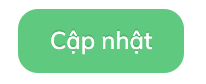
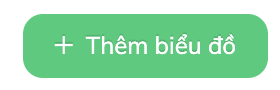
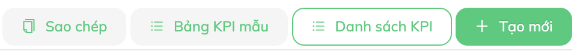
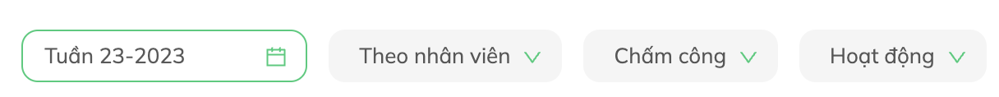
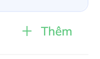
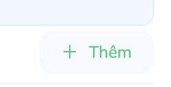

# Buttons

Một số quy tắc khi sử dụng button trên Tanca Admin

Cách dùng:

```js
import { Button } from "antd";
```

## Button Primary

 

Loại button đc sử dụng nhiều nhất, thường dùng cho hành động chính của một chức năng

- Background màu --color-primary
- Không border
- Hover backgroound màu --color-primary-hover
- Chứ màu trắng
- **type="primary"**

```js
<Button
  onClick={() => {}}
  type="primary">
  {intl.formatMessage(Messages.update)}
</Button>
```

## Button Ghost



Ở 1 chức năng thường chỉ có 1 button Primary duy nhất, còn lạy nếu có thêm các nút chức năng thì dùng button Ghost và đặt bên cạnh button Primary

Style mặc định (nút **"Sao chép"**)

```css
background-color: var(--color-gray-3);
border-color: var(--color-gray-3);
color: var(--color-primary);
```

Style khi hover (nút **"Danh sách KPI"**)

```css
background-color: white;
border-color: var(--color-primary);
color: var(--color-primary);
```

:::info Lưu ý thêm
Ở một số component khác nếu có cùng style kiểu **khi hover lên mới hiện border lên** thì ở trạng thái chưa hover nên để có 1 **border-width** bằng với **border-width khi hover** và **border-color** là `transparent` hoặc trùng với màu của **background-color**

Việc này tránh trường hợp UI bị giật, lệch khi có hover.
:::

- Các icon bên trong nếu có thì màu --color-primary
- **type="ghost"**

```js
<Button
  className="ml-2"
  type="ghost"
  icon="bars"
  onClick={() => gotoRoute(KPI_SETTING_LIST)}>
  <FormattedMessage {...Messages.kpi_list} />
</Button>
```

## Button Ghost Icon


Loại button này tương tự như Button Ghost nhưng không có sử dụng label của button chỉ có icon

Loại này được dùng nhiều ở mục [Buttons](/docs/front-end/web-admin/Layout/#phần-dưới-bên-phải-buttons) của Layout

```js
<Button
  className="ml-2"
  type="ghost"
  onClick={openDrawer}>
  <i class="far fa-bars"></i>
</Button>
```

## Button Ghost Select



Loại này không phải là button, nó là một select nhưng về màu sắc thì dùng giống hệt Button Ghost chỉ khác là các icon nằm bên phải thay vì bên trái như Button Ghost

Loại này được dùng nhiều ở mục [Filters](/docs/front-end/web-admin/Layout/#phần-dưới-bên-trái-filters) của Layout

Sử dụng Select của Antd

Ví dụ:

```js
<Select
  dropdownMatchSelectWidth={false}
  value={viewMode}
  onChange={this._onChangeViewMode}>
  <Select.Option value="by-timekeeping-detail">
    <span className="mx-2">{intl.formatMessage(Messages.In_Out)}</span>
  </Select.Option>
  <Select.Option value="by-branch">
    <span className="mx-2">{intl.formatMessage(Messages.branch)}</span>
  </Select.Option>
  <Select.Option value="by-project">
    <span className="mx-2">{intl.formatMessage(Messages.project)}</span>
  </Select.Option>
  <Select.Option value="by-coefficient">
    <span className="mx-2">
      {intl.formatMessage(Messages.shift_coefficient)}
    </span>
  </Select.Option>
  <Select.Option value="by-working-hour">
    <span className="mx-2">{intl.formatMessage(Messages.working_hour)}</span>
  </Select.Option>
</Select>
```

## Button Link

Button link thường nằm phía bên trong phần content của 1 trang thay vì nằm ở góc ngoài như Button Primary hay Button Ghost

Style mặc định



```css
backgroud-color: white;
color: var(--color-primary);
```

Hovered



```css
backgroud-color: var(--color-neutral-02);
color: var(--color-primary);
```

Cách sử dụng

```js
<Button
  type="link"
  className="color-primary"
  onClick={addItem}>
  <Icon type="plus" />
  <FormattedMessage {...Messages.more} />
</Button>
```
