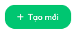
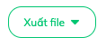

# ButtonWidthDropdown

Là các thành phần nút được sử dụng nhiều ở [Main buttons](/docs/front-end/web-admin/Layout/#phần-trên-bên-phải-main-buttons) trong [Header](/docs/front-end/web-admin/Layout/#phần-trên-header) của mỗi [Layout](../Layout/layout.md) trang web



Cho phép tạo ra các dạng component như:

- **Button and Dropdown**: Có cả hành động click và dropdown select khi re chuột vào.
- **Button only**: Chỉ là một button, chỉ có hành động click bình thường
- **Dropdown only**: Chỉ là một dropdown select, có hành động chọn một option trong danh sách dropdown xuất hiện khi rê chuột vào.

### Cách sử dụng (Usage)

```js
import ButtonWithDropdown from "components/ui/ButtonWithDropdown/ButtonWithDropdown";
```

## Button and Dropdown


Để có giao diện vừa click được, vừa có dropdown thì truyển **callbackButton** và **dropdownMenu** vào

```js
<ButtonWithDropdown
  title={intl.formatMessage(Messages.create_shift)}
  className="ml-2"
  type="primary"
  size="large"
  dropdownMenu={shiftActionsMenu} // shiftActionsMenu là một <Menu/> được định nghĩa trước
  callbackButton={this._onNewShift}
/>
```

shiftActionsMenu:

```js
const shiftActionsMenu = (
  <Menu>
    <Menu.Item>
      <a onClick={() => this._onNewShift()}>
        {intl.formatMessage(Messages.create_shift)}
      </a>
    </Menu.Item>
    <Menu.Item>
      <a onClick={() => gotoRoute(WORKING_SHIFT_LIST)}>
        {intl.formatMessage(Messages.list_shift)}
      </a>
    </Menu.Item>
    <Menu.Item>
      <a
        onClick={() =>
          this.shiftAssignmentModalRef && this.shiftAssignmentModalRef.show()
        }>
        {intl.formatMessage(Messages.scheduling)}
      </a>
    </Menu.Item>
    <Menu.Item>
      <a onClick={this._openCopyShiftModal}>
        {intl.formatMessage(Messages.copy_shift)}
      </a>
    </Menu.Item>
    <Menu.SubMenu
      title={
        <span>{intl.formatMessage(Messages.import_time_tracking_data)}</span>
      }>
      <Menu.Item>
        <a onClick={this._importEmployeeShifts}>
          {intl.formatMessage(Messages.import_employee_shifts)}
        </a>
      </Menu.Item>
      <Menu.Item>
        <a onClick={this._importProjects}>
          {intl.formatMessage(Messages.import_project)}
        </a>
      </Menu.Item>
    </Menu.SubMenu>
    <Menu.Item>
      <a onClick={this._gotoSmartAssignShift}>
        {intl.formatMessage(Messages.smart_scheduling)}
      </a>
    </Menu.Item>
  </Menu>
);
```

## Button only


Để có giao diện chỉ có click được mà không có dropdown menu thì truyển **callbackButton** và **không truyển dropdownMenu**

```js
<ButtonWithDropdown
  title={intl.formatMessage(Messages.add)}
  className="ml-2"
  size="large"
  type="primary"
  callbackButton={() => {}}
  icon={<i class="far fa-plus"></i>}
/>
```

## Dropdown only


Để có giao diện chỉ có menu được mà không click trực tiếp được thì truyển **dropdownMenu** và **không truyển callbackButton**

```js
<ButtonWithDropdown
  title={intl.formatMessage(Messages.export_file)}
  className="ml-2"
  dropdownMenu={
    <Menu>
      <Menu.Item onClick={() => {}}>
        <a>{intl.formatMessage(Messages.export_timekeeping)}</a>
      </Menu.Item>
      <Menu.SubMenu title={intl.formatMessage(Messages.export_overtime_excel)}>
        <Menu.Item onClick={() => {}}>
          <a>{intl.formatMessage(Messages.by_overtime)}</a>
        </Menu.Item>
      </Menu.SubMenu>
    </Menu>
  }
  size="large"
/>
```

## Bảng mô tả thuộc tính (Props)

| Props          | Description                                                                                               |
| -------------- | --------------------------------------------------------------------------------------------------------- |
| dropdownMenu   | Danh sách các lực chọn của Dropdown (Menu của antd, các Menu.Item phải có onClick hoặc onChange ở Menu)   |
| callbackButton | Callback sự kiện click vào button nếu có                                                                  |
| title          | Title của nút                                                                                             |
| icon           | Thêm icon nằm phía trước **title**, nên dùng FontAwesome                                                  |
| tooltipTitle   | Tooltip hiển thị thêm nếu có                                                                              |
| className      | Custom thêm các class nếu có, nên thêm các class để chỉnh sử vị trí tránh thay đổi cấu trúc của component |
| style          | Custom thêm các style nếu có, nên thêm các class để chỉnh sử vị trí tránh thay đổi cấu trúc của component |
| type           | thuộc tính của AntD Button `primary` hoặc `ghost` .v.v                                                    |
| size           | thuộc tính của AntD Button                                                                                |
| loading        | thuộc tính của AntD Button thể hiện Loading của button                                                    |
