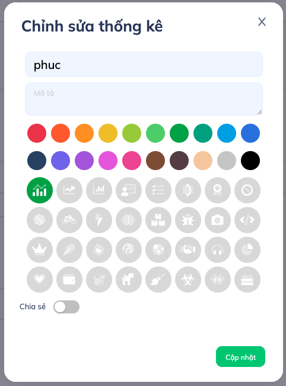

# GeneralModal

Tiêu chuẩn chung của một modal áp dụng cho tất cả các modal trong trang web.
Cấu trúc bao gồm:

## Cấu trúc

- **Header**: Bên trái là Title, bên trái là nút tắt modal
- **Body**: Nội dung chính của modal
- **Footer**: Chứa các actions button

  
  
  

### Title

Nội dung được truyền vào qua **renderTitle**

Tiêu đề của modal ngắn gọn không quá dài (string)


### Body

Nội dung được truyền vào qua **renderBody**

Nội dụng của modal không nên có padding vì đã có padding mặc định giúp nội dung và title căng chỉnh cân đối


### Footer

Nội dung được truyền vào qua **renderFooter**

- Chứa các action buttons
- Được sắp xếp từ bên phải qua (flex-row-reverse)
- Bên phải cùng là button chức năng chính của modal màu Primary (Update, Create,..)
- Kế tiếp bên trái là các Button chức năng phụ màu ghost hoặc link
- Các button cách nhau 1 khoảng **ml-3**
- Foot không chứa các nút có chức tắt modal như Cancel, Close,.. (Dùng X để đóng)


## Hướng dẫn sử dụng

Cách dùng

```js
import GeneralModal from "components/ui/GeneralModal";
```

Example

```bash
<GeneralModal
  centered
  visible={visible}
  wrapClassName="modal-export-container"
  maskClosable={false}
  renderTitle={intl.formatMessage(Messages.modal_title)}
  renderFooter={
    <React.Fragment>
      <Button
        onClick={() => {}}>
        {intl.formatMessage(Messages.cancel)}
      </Button>
      <Button
        onClick={() => {}}
        disabled={disabled}
        className="ml-3"
        type="primary"
        icon="download">
        {intl.formatMessage(Messages.download)}
      </Button>
    </React.Fragment>
  }
  renderBody={
    <div>
      YOUR CONTENT HERE...
    </div>
  }>
</GeneralModal>
```

## Bảng mô tả thuộc tính (Props)

| Props         | Description                                                                |
| ------------- | -------------------------------------------------------------------------- |
| renderTitle   | truyền vào 1 giá trị String                                                |
| renderBody    | Nội dung của modal bất kì                                                  |
| renderFooter  | Các action buttons của modal                                               |
| visible       | Trạng thái hiển thị của modal                                              |
| wrapClassName | Class Name wrapper của modal                                               |
| ...els        | Các giá trị props còn lại truyền vào sẽ được truyền vào như Modal của Antd |
