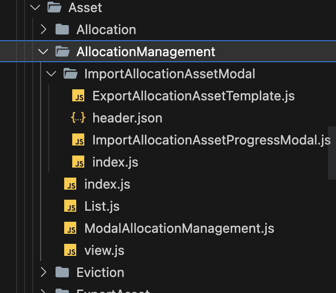
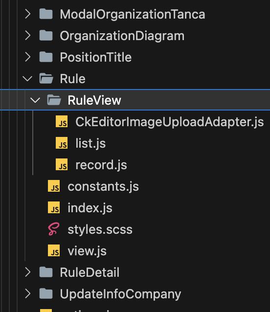
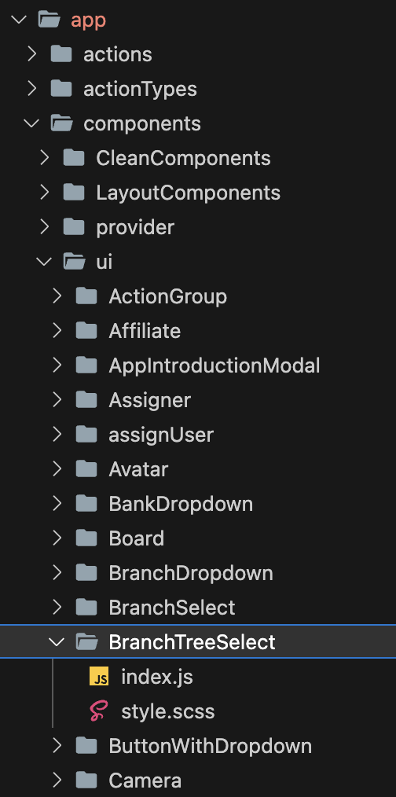

# Component Creation

Khi nào thì tạo ra 1 component?

- Khi một UI nào đó quá phức tạp, nhiều UI chồng chéo lên nhau
- Khi một UI được sử dụng ở nhiều (từ 2) vị trí trong một trang, một file hoặc ở nhiều trang, nhiều file khác nhau

## Create and Name (Tạo file và Đặt tên)

Có 2 cách để tạo file cho một component

### File component

- Tạo trực tiếp một file với tên component theo format **PascalCase**
- Trong file sẽ **export default** component chính để sử dụng
- Dạng này dùng cho các component đơn giản ít sử dụng style hoặc không dùng file scss để styling

### Folder component

- Bao gồm một folder tên component với format **PascalCase**
- Bên trong chữa 1 file **index**
- Trong file **index** sẽ **export default** component chính
- Bên cạnh sé là file styles.scss hoặc các component khác
- Component to nhất nên được wrap bởi 1 class riêng và style tất cả trong styles.scsc bên cạnh

Ví dụ:

- **AllocationManagement**, **ImportAllocationAssetModal** là các Folder component
- **ModalAllocationManagement** ,**ImportAllocationAssetProgressModal** ,**ExportAllocationAssetTemplate** là các File component.



## Locate the component (Vị trí component)

Để bắt đầu việc tạo ra 1 component phải xác định component này dùng ở đâu

- Nếu component chỉ sử dụng cho một chỗ đặc thù và không thể tái sử dụng ở 1 trang khác => Ta đặt component đó ngay tại thư mục của trang đang dùng
- Nếu component là một UI xuất hiện nhiều lần và có thể tái sử dụng ở nhiều trang, nhiều file => Ta tạo component vào thư mục `app/components/ui` (Reusable Component)

Ví dụ 1:



Ở trang Rule, RuleView là một UI phức tạp bên trong sẽ bao gồm nhiều component nhỏ bên trong nữa

Nhưng RuleView này chỉ đặc thù cho tràng Rule và không thể dùng ở 1 nơi nào khác nên ta tạo trực tiếp bên cạnh file index của trang Rule và sử dụng 1 lần

Ví dụ 2:



BranchTreeSelect là một component dùng để chọn một chi nhánh, UI này được sử dụng nhiều trang, nhiều file nên sẽ được tạo ra ở thư mục `app/components/ui`

## Props

Các props tạo ra để truyền vào component phải:

- **Ngắn gọn** => dễ nhớ, dễ sử dụng, nhưng phải đúng nghĩa đúng mục đích
- **Dễ nhớ** => Dùng props đó 1 lần thì lần sau nhớ và dùng không cần phải xem lại code cũ nữa
- **Dể hiểu** => Đọc props đó mình hình dung được nó có tác dụng làm gì
- **Dễ sử dụng** => tối thiểu các props, các tập giá trị của mỗi props không phức tạp hóa vấn đề
- **Dùng cho thiểu số thay vì đa số** => với các props boolean thì nên mặc định là true cho đa số các case, chỉ truyền thêm ở các case số ít

ví dụ:

```js
<CustomInputItem
  fieldName="address"
  label={intl.formatMessage(Messages.address)}
  placeholder={intl.formatMessage(Messages.address)}
  labelRatio="30%"
  wrapperRatio="70%"
  defaultValue={shopData.address || ""}
  inputType="textarea"
  {...props}
/>
```

- Thay vì **labelRatio** và **wrapperRatio** => ta chỉ cần **labelRatio** vì lúc nào tổng cũng phải 100% và từ wrapper cũng khó nhớ
- Thay vì **inputType** => chỉ cần đặt là **type** vì cơ bản Component này đã là Input từ trong cái tên rồi
- Thay vì **defaultValue** ta có thể dùng **initValue** vì **defaultValue** có thể trùng trên với props của Antd nên bị dư sẽ có warning trong console Log khá khó chịu

:::caution Lưu ý
Hạn chế (tốt nhất là không có) các trường hợp cho phép truyển style hay className để custom lại component. Vì đã là common UI component thì không nên có trường hợp style riêng cho từng chỗ nó sẽ mất đi tính nhất quán (Consistenly).
Mỗi component đều nên có wrapper bọc bên ngoài và không được style wrapper đó ví dụ:

```js
<div className={className}> [Main UI content here] </div>
```

Nếu có thì chỉ nên sử dụng truyển className cho wrapper của UI chính cho một số trường hợp cần margin, padding (thay đổi vị trí không thay đổi cấu trúc).
:::

Ví dụ:

- Thay vì truyền
