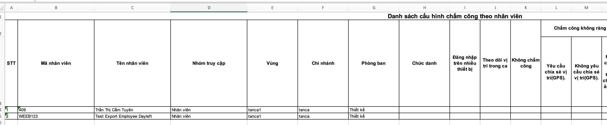
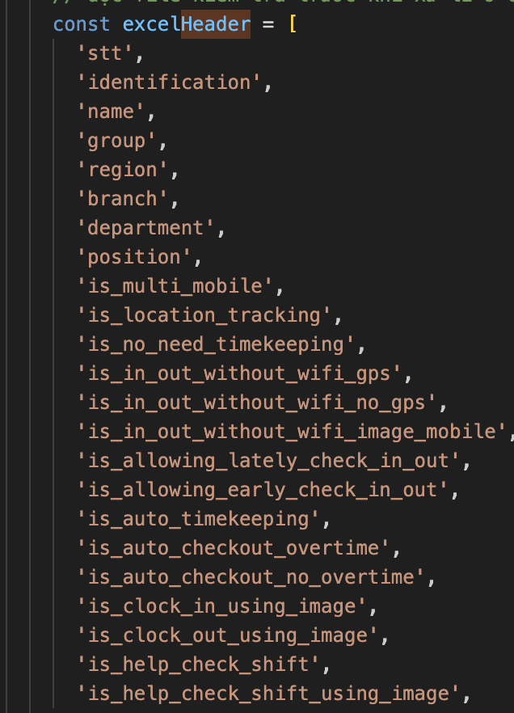

# Import/Export Excel

Trong việc quản lí thông tin ta sẽ tiếp xúc với rất nhiều danh sách dữ liệu như Nhân viên, Ca làm, Phòng ban, Chi nhánh,... Khi dữ liệu đạt số lượng đủ nhiều thì việc xử lý từng dữ liệu một rất khó tránh khỏi việc sai xót nên nhu cầu về xử lý dữ liệu hàng loạt được sinh ra để giải quyết vấn đề này.

Export/Import có các tính năng nổi bật:

- **Xuất số lượng lớn dữ liệu ra file Excel** - cho phép xem tổng quan hoặc xử lý xử dụng ở nhiều mục đích khác từ file Excel.
- **Nhập hàng loạt thông tin mới** - cho phép tạo hàng loạt dữ liệu cùng lúc tránh các lỗi nhập liệu khi xử lý từng dữ liệu.
- **Cập nhật hàng loạth** - cho phép chỉnh sửa và cập nhật nhiều dữ liệu một cách nhanh chóng

## Export

### Name the file (Đặt tên)

Mỗi một file excel xuất ra phải đảm bảo tên file được đặt đúng quy tắt sau:

- **View (chỉ xem)** - Tên phải là danh từ thể hiện rõ trong file chứ nội dung gì và không được trùng với bất kì file xuất ra ở chỗ khác. Ví dụ:

```
// vi
Bang_Ngay_Cong_Theo_Du_An.xlsx
Bang_Gio_Cong_Theo_Chi_Nhanh.xlsx
Danh_Sach_Cong_Viec_Trong_Du_An.xlsx
// en
Salary_n_Allowance_List.xlsx
Timekeeping_Shifts_By_Hour_Vertical.xlsx
Timekeeping_Shifts_By_Day_Vertical.xlsx
```

- **Create, Update (Tạo và Sửa)** - trong tên phải có có từ "Mẫu" (template) để thể hiện nó là file dùng để import, bên cạnh cũng thể hiện được hành động của file sẽ làm gì. Ví du:

```
Mau_Cap_Nhat_Tien_Luong_Tro_Cap.xlsx
Mau_Cap_Nhat_Phan_Quyen_Theo_Nhan_Vien.xlsx
Mau_Cap_Nhat_Phan_Quyen_Theo_Nhom_Quan_Ly.xlsx
// en
Import_Shift_Template.xlsx
Import_Update_Shift_Template.xlsx
Import_Dayoff_Template_By_Total.xlsx
```

#### ModalExportExcelWithTable

Đây là 1 bộ Export được được cấu hình sẵn, chỉ cần extends và custom lại các hàm cần thiết

Flow Export ModalExportExcelWithTable gần 4 giai đoạn:

1. **Setup**: Set up thông tin header, api, column ngay tù đầu sau đó gọi "Start"
2. **Request data**: Lấy dữ liệu từ api về và xử lý hiển thị phần trăm
3. **Create table**: Dữ liệu được xử lí và tạo ra một html table ẩn trong trang hiện tại
4. **Download**: Từ table đã tạo ra đóng gói vào file excel và tải về

Flow (theo các keyword chính):

(1) **Start** => **onBeforeStart**

(2) **requestData** => **processData** => **processItem** => **processDone** (quay lại **processData** nếu vẫn còn dữ liệu) => **createTableHtml**

(3) **buildHeader** => **buildDataRows** => **createElement** => **appendChild**

(4) **tableToSheet** => **Save**

Một số keyword, function quan trọng:

- **onBeforeStart**: Rất quan trọng, cho phép setup headers (this.headers) và data Indexes đảm bảo hiển thị đúng và đẹp
- **requestData**: Bắt đầu get data về
- **processData**: Xử lí dữ liêu nhận về hiển thị phần trăm
- **processItem**: Nhận 1 item trong array get được và transform thành một data mới phù hợp với dataIndexes, nếu chưa lấy đủ hết data sẽ quay lại **requestData**
- **processDone**: Sau khi đủ dữ liệu tiến hành đóng gói thành table

  - **tableHTMLRows**: Tạo ra 1 table html dưới dạng string
  - **buildHeader**: Build ra header của table `th` và chèn vào table
  - **buildDataRows**: Build các dữ liệu ứng với header `td` và chèn vào table
  - **createElement**: Tạo ra 1 `<div/>` và chèn table vừa sinh ra ở trên vào
  - **appendChild**: Cuối cùng gắn vào trong app dưới dạng ẩn `'display:none;'`

- **tableToSheet**: Khi user bấm Download thì sẽ thực hiện convert table html bên trên thành sheet trong file xlsx
- **Save**: và tự động tải xuống

```js title="Convert string table to html element"
const tableContaner = document.createElement("div");
tableContaner.id = "forTableToExcel";
tableContaner.innerHTML = tableHTMLRows;
tableContaner.style = "display:none;";
document.body.appendChild(tableContaner);
```

```js title="Convert table to xlsx file and download"
download(filename) {
    try {
      const tableSheet1 = document.getElementById('export_table');
      const tableSheet1Opts = {
        autoStyle: false,
        sheet: {
          name: 'Sheet 1',
        },
      };

      let wb = TableToExcel.initWorkBook();
      wb = TableToExcel.tableToSheet(wb, tableSheet1, tableSheet1Opts);

      TableToExcel.save(wb, filename || 'export.xlsx');
    } catch (e) {
      // Todo
    }
  }
```

- **this.url**: api url để gọi lấy dữ liệu
- **this.params**: params đi chung với this.url
- **this.headers**: bên trong **onBeforeStart** sẽ push các header vào từ bên trái qua (có thể custom màu, font-size, rowspan,...)
- **this.dataIndexes**: ứng với 1 **Headers** sẽ có 1 **Indexes**, có field **index** (string), mặc định sẽ đọc field đó của dữ liệu và show lên, trường hợp field đó không phải là string thì dùng **renderCell** và phải return về 1 json

```js
renderCell: (item, dateIndex) => {
  const value = item.name;
  const dataType = 'data-t="s"';
  const fontSize = `data-f-sz="9"`;
  return {
    value,
    html: `
      <td ${dataType}  ${fontSize} data-fill-color="8DB4E2" data-a-h="s">${value}</td>
    `,
  };
};
```

:::caution Lưu ý
Length của **headers** và **indexes** phải bằng nhau để mỗi row render ra không bị lệnh
Trừ một số trường hợp sử dụng colspan phải tính toán chính xác
:::

#### AdvanceModalExportExcel

Cũng là một module dùng để xuất excel được extends từ **ModalExportExcelWithTable** nhưng có nhiều phần cải tiến và dễ sử dụng hơn. Tham khảo thêm tại
`app/components/ui/ModalExportExcel/AdvanceModalExportExcel.js`

### Export for view (Xem)

- Xuất thông tin ra file excel để xem hoặc sử dụng với mục đích khác ở 1 nơi khác
- Không có giá trí import lại vào Tanca

### Export for import (Thêm, Sửa)

Thường sẽ dùng để export ra 1 file excel và chỉnh sửa thông tin trong file và import trở lại để xử lí dữ liệu (Thêm mới và Cập nhật).

- **Tất cả** file xuất ra **phải có** 1 sheet **Thông tin** chứa thông tin **để** quá trình **Import** có thể xử lí được. Thông tin bao gồm:

  - **Thông tin**: Thể hiện được file đang dùng để làm gì
  - **Từ khóa**: Từ khóa của file, không trùng với các hành động khác
  - **Phiên bản**: Dùng để phân biệt khi có cập nhật thì không dùng được file cũ nữa

- Đối với file dùng để **Thêm mới**: File xuất ra phải có sẵn header, thể hiện được cột nào bắt buộc, cột nào không bắt buộc
- Đối với file dùng để **Cập nhật**: File xuất ra phải có một cột chứ thông tin định danh (id, user_id, identification,...) hỗ trợ việc import định danh được và cập nhật
- Thường sẽ sử dụng **AdvanceModalExportExcel** để xuất file và sử dụng hàm **createTableHtml** để tạo ra bảng thông tin và chèn vào ở `download()`. (search `createTableHtml` để tham khảo)

### Implementation (Triển khai)

1. Xác định file cần xuất ra sẽ như nào
2. Xem trên website xem chỗ nào xuất ra file gần giống cấu trúc của file cần làm
3. Từ tên file tham khảo tìm ra file .js
4. Clone file ra một file khác và đặt đúng vị trí mới
5. Đọc code, hiểu và biến đổi (đọc code và xem lại phần [ModalExportExcelWithTable](/docs/front-end/web-admin/import-export-excel#modalexportexcelwithtable))

- Clone code ra và xuất cho được giống hệt file cũ
- Bắt đầu chỉnh sử header giống file mới
- Đổi api url
- Xử lí lại data (processItem)

6. Đặt lại tên file
7. Đặt lại file key, version (tham khảo `app/components/ui/ExcelCheckVersion`)

## Import

Hiểu một cách đơn giản quá trình import sẽ hoạt động như sau:

**1. Định nghĩ 1 file json header**

- Mỗi column trong file excel sẽ có 1 keyword (field_name)




<!--  -->
<!--  -->

**2. Đọc file excel**

- Dùng XLSX để đọc ra trang chứa dữ liệu và trang chứ thông tin file dưới dạng json
- Kiểm tra thông tin file và vị trí import file, báo lỗi nếu không hợp lệ

Tham khảo hàm `ReadExcelFile` tại file `ExcelCheckVersion`

**3. Chuẩn hóa dữ liệu**

- Chuẩn hóa json đọc được từ file thành array data theo file header trên

**4. Bắt đầu post dữ liêu**

- Tắt đoạn array thành từng phần và post lên server xử lí
- Nhận respone và thể hiện tiến độ, báo lỗi nếu có
